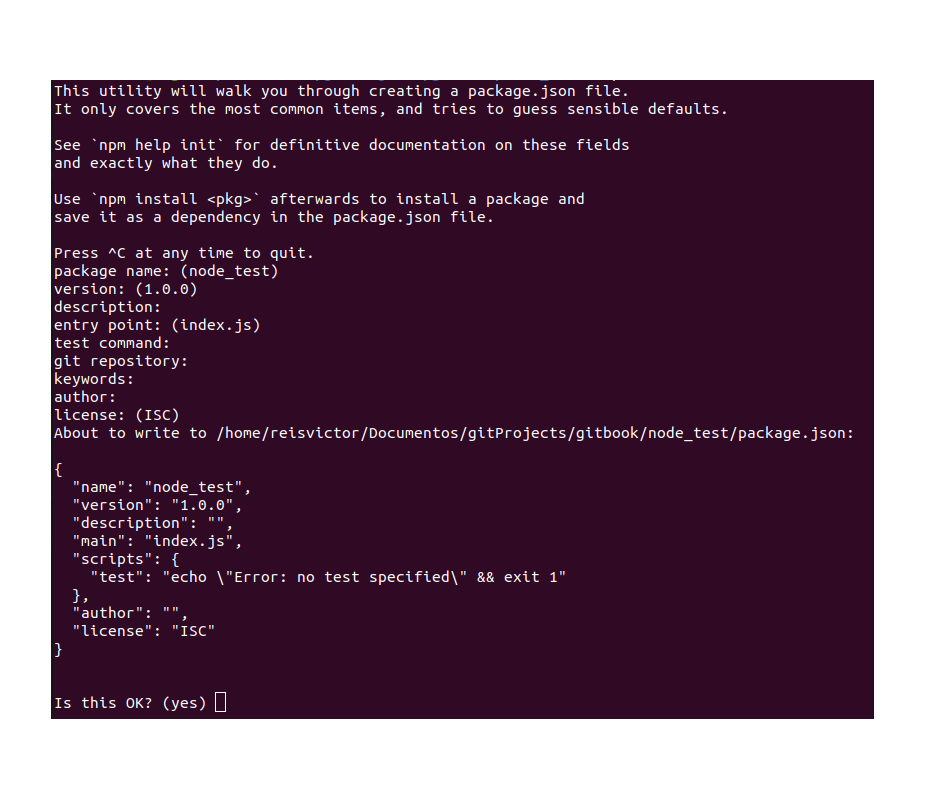
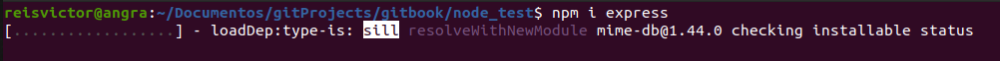
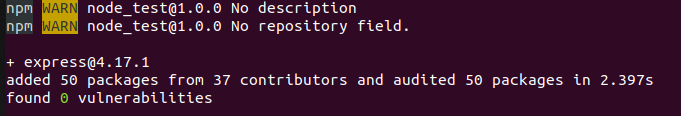
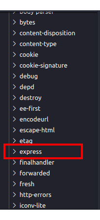

# Utilizando o NPM

## Instalando NPM na sua máquina

O NPM, como mencionado no capítulo anterior, é um gerenciador de pacotes. Seu objetivo é facilitar o uso de algumas bibliotecas e frameworks ligados ao NodeJS.

Para instalar o NPM, tudo o que precisa fazer \(em linha de comando\) é rodar o seguinte comando:

```text
sudo apt-get install npm
```

Com isso, a instalação irá acontecer devidamente. Caso o Node tenha sido instalado corretamente, o NPM pode ter sido instalado junto.

## Inicializando um projeto com NPM

Para inicializar o uso do NPM em uma pasta, é só fazer:

```text
npm init
```

Logo em seguida, o NPM irá pedir para que você insira algumas informações, mas se deixá-las em branco, como mostrado na imagem abaixo \(só ir apertando a tecla Enter ou inserir -y no comando acima\), o sistema irá deixar a pasta no padrão.



Dessa forma, o NPM irá preparar sua pasta para documentação \(no package.json\) e receber os pacotes do ecossistema npm.

## Arquivo package.json

O arquivo package.json é um arquivo chave do projeto. Nele, você vai ver várias configurações associadas ao projeto, como o nome do projeto, sua descrição, os scripts de inicialização do projeto, as dependências \(os pacotes instalados no projeto\), a licença utilizada e, principalmente, os autores do projeto.

## Instalando pacotes

Para instalar algum pacote do ecossistema do NPM, a maioria dos pacotes podem ser instalados via o comando:

```text
npm install <nome_do_pacote>
```

Na imagem a seguir, mostra-se a instalação de um pacote bem conhecido chamado "express":

_OBS: "i" é uma forma reduzido de "install". O NPM irá entender ambos._





Caso queira instalar algum pacote globalmente, então:

```text
npm install -g <nome_do_pacote>
```

Isso faz com que o pacote possa ser acessível pelo sistema sem precisar instalá-lo em cada repositório/projeto que criar. Diferente de um pacote instalado localmente, em que é só acessível pelo repositório atual.

Caso o pacote não siga esse padrão, é só procurar no site[ https://www.npmjs.com](https://www.npmjs.com), onde existe uma gama de pacotes disponibilizados e a maneira correta de intalá-los.

Os pacotes instalados vão ser colocadas numa pasta chamada node\_modules:



Como o package.json é atualizado a cada pacote instalado, caso a pasta node\_modules não esteja dentro da pasta escolhida para o projeto, você só precisa executar:

```text
npm install
```

...que todos os pacotes configurados no package.json serão instalados e a pasta node\_modules será criada.

Para desinstalar algum pacote pelo NPM:

```text
npm uninstall <nome_do_pacote>
```

Com os comandos mostrados, deseja-se ter total controle dos repositórios em que se utilizam os pacotes do ecossistema NPM.

