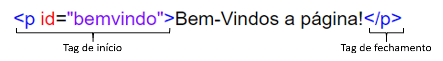

# Anatomia de um comando

Antes de explicarmos como funciona um comando de CSS precisamos observar um exemplo. Na primeira aba abaixo tem um código HTML e na segunda aba o seu resultado. Na terceira aba, temos o código CSS que está no arquivo "style.css", e na quarta aba está o resultado com o CSS.



```markup
<!DOCTYPE html>
<html>
<head>
    <title>Exemplo</title>
    <link rel="stylesheet" type="text/css" href="style.css">
</head>
<body>
  <h1>A melhor pizza</h1>
  <p>A melhor pizza do mundo é a quadrada com molho de tomate verde.</p>
</body>
</html>
```







```css
p {
    color: green;
}
```







Se compararmos o resultado sem CSS e com CSS podemos observar que na útima aba o parágrafo está verde. 

Agora vamos observar nosso CSS de perto:



Essa estrutura é chamada de **conjunto de regras**. Vamos examinar cada elemento.

* **Seletor:** é responsável por selecionar o elemento a ser estilizado, nesse caso o &lt;p&gt;. Vamos apresentar os tipos de seletores e como eles funcionam na seção "Seletores".
* **Propriedade:** é reponsável por escolher qual propriedade do elemento será alterado, nesse caso "color" é responsável pela cor do elemento. Vamos apresentar outras propriedades em "Propriedades mais usadas".
* **Valor da propriedade:** é responsável por apresentar o valor da propriedade, nesse caso escolhemos "green" \(verde\), por isso nosso parágrafo ficou verde.
* **Declaração:** Uma declaração é composta por uma propriedade e seu respectivo valor. Um comando pode possuir mais de uma declaração.

Outros elementos que valem ser destacados são:

* Cada comando precisa estar dentro de chaves **`{}`** 
* A propriedade e o valor da propriedades são separadas por dois pontos **`:`**
* No fim de cada declaração é necessário colocar dois pontos **`;`**

