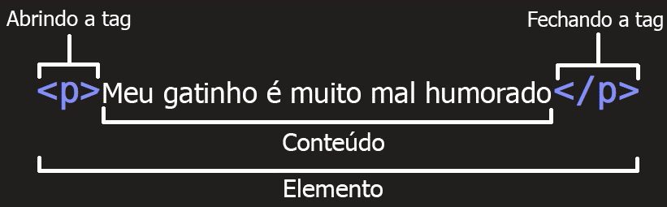

# O que são tag's?

Você irá escrever o HTML por meio de tag's. Elas serão responsáveis por informar ao navegador o que deve ser feito naquela posição com aquele conteúdo.

Por exemplo, se queremos que o título da nossa página seja "USPCodeLab, o melhor grupo", vamos escrever o seguinte:

```text
<h1>USPCodeLab, o melhor grupo</h1>
```

Agora podemos observar a estrutura de uma tag.



Portanto, nos utilizamos "&lt; &gt;" para defirmos qual tag vamos usar; utlizamos a "/" para declaramos que essa é a nossa tag de fechamento; entre as tag iremos colocar o contéudo que a tag pede.


Algumas tag's não necessitam ser fechadas. Elas são chamadas de **tag vazia**.


