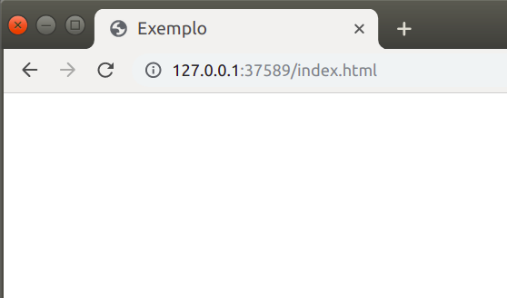

# Básicas

**&lt;html&gt;&lt;/html&gt;** — Esse elemento envolve todo o conteúdo da página e é conhecido como **elemento raiz**.

**&lt;head&gt;&lt;/head&gt;** — Esse elemento age como um recipiente de tudo o que você deseja incluir em uma página HTML, mas que não é o conteúdo que você quer mostrar para quem vê sua página. Por exemplo: palavras-chave, uma descrição que você quer que apareça nos resultados de busca, importação de arquivos externos, declarações de conjuntos de caracteres, e mais.

**&lt;title&gt;&lt;/title&gt;** — Indica o título da sua página, que é o título que aparece no topo do navegador quando sua página carrega, e é usado para descrever a página quando você a coloca nos favoritos.

**&lt;body&gt;&lt;/body&gt;** — Contém todo o conteúdo que você quer mostrar ao público que visita sua página, seja texto, imagens, vídeos, jogos, faixas de áudio tocáveis, entre outros.

**&lt;!--** Isso é um comentário **--&gt;** — Faz um comentário no código-fonte. Não aparece na sua página.

**&lt;!DOCTYPE html&gt;** — Apesar de não ser uma tag, é necessário que você escreva no início do seu arquivo para indicar ao navegador que tipo de arquivo ele deve esperar.

## Exemplo

Abaixo mostramos um exemplo de como essas tags devem ser escritas. Na aba "Código" está o código, e na aba "Resultado" está a página resultante.



```markup
<!DOCTYPE html>
<html>
<head>
    <title>Exemplo</title>
</head>
<body>
    <!-- Será que isso aparece? -->
</body>
</html>
```







