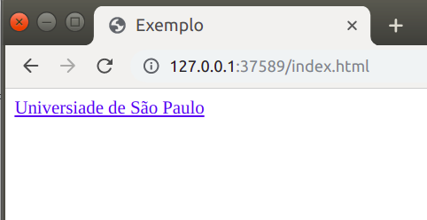

# Link

**&lt;a&gt;&lt;/a&gt;** — Essa TAG define um hiperlink, ou seja, ela é usada para linkar uma página a outra. Para definir qual link que a TAG deve encaminhar, vamos usar o atributo "href".

## Exemplo

Abaixo mostramos um exemplo de como essas TAG devem ser escritas. Na aba "Código" está o código, e na aba "Resultado" está a página resultante.



```markup
<!DOCTYPE html>
<html>
<head>
    <title>Exemplo</title>
</head>
<body>
    <a href="https://pt.wikipedia.org/wiki/Universidade_de_S%C3%A3o_Paulo">Universidade de São Paulo</a>
</body>
</html>
```







