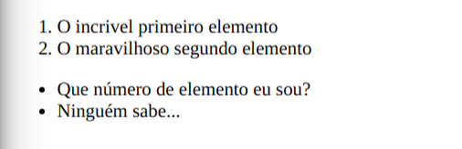

# Listas

As principais listas utilizadas em HTML são as listas ordenadas e as desordenadas.

Abaixo temos as instruções de como trocar uma lâmpada. Isso é uma lista ordenada.

1. Pegar uma lâmpada nova
2. Subir em um banquinho
3. Não cair
4. Retirar a lâmpada queimada
5. Colocar a lâmpada nova

Abaixo temos uma lista de supermercado. Isso é uma lista desordenada.

* Morango
* Sorvete
* Chantilly
* Suspiro

**&lt;li&gt;&lt;/li&gt;** — Qualquer item dessas listas devem colocados entre essas tags.

**&lt;ol&gt;&lt;/ol&gt;** — Essa tag define uma lista ordenada.

**&lt;ul&gt;&lt;/ul&gt;** — Essa tag define uma lista desordenada.

## Exemplo

Abaixo mostramos um exemplo de como essas tags devem ser escritas. Na aba "Código" está o código, e na aba "Resultado" está a página resultante.



```markup
<DOCTYPE html>
<html>
<head>
    <title>Exemplo</title>
</head>
<body>
    <ol>
    <li>O incrível primeiro elemento</li>
    <li>O maravilhoso segundo elemento</li>
    </ol>
    <ul>
    <li>Que número de elemento eu sou?</li>
    <li>ninguém sabe...</li>
    </ul>
</body>
</html>
```







