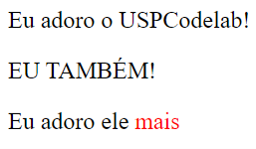

# Organização

**&lt;div&gt;&lt;/div&gt;** — Essa TAG define uma seção ou uma divisão em um documento HTML. Ela é utilizada para conter outros elemento do HTML que então podem ser estilizados com CSS ou manipulados com JavaScript.

**&lt;span&gt;&lt;/span&gt;** — Essa TAG define uma seção dentro de uma linha do HTML. Ela pode ser facilmente utilizada pelo CSS ou JavaScript, além disso também se pode utilizar o atributo "style".

## Exemplo

Abaixo mostramos um exemplo de como essas TAG devem ser escritas. Na aba "Código" está o código, e na aba "Resultado" está a página resultante.



```markup
<div>
    <p>Eu adoro o USPCodelab!</p>
    <p>EU TAMBÉM!</p>
</div>
<p>Eu adoro ele <span style="color:red"> mais </span></p>
```







