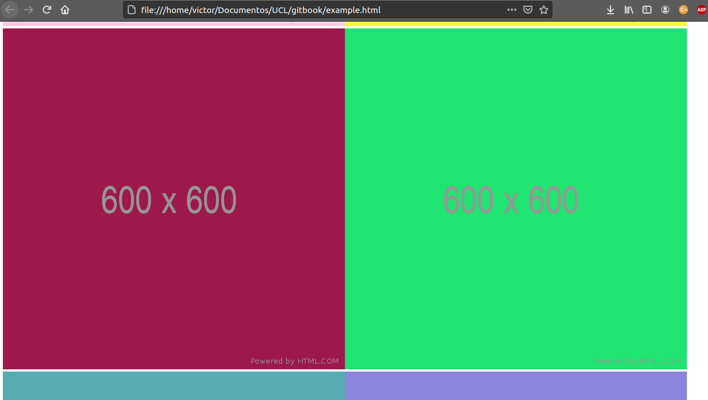

# Conversando com um servidor

Há infinitas maneiras de fazer requisições em javascript ou nodeJS, porém, neste capítulo, mostraremos uma as maneiras mais simples de executar requisições.

Para tal, iremos utilizar a função fetch. Esssa função faz requisições, seja de qualquer método HTTP, e retorna uma promise que teremos que lidar.

Nosso exemplo iremos tirar imagens de uma API pública, na seguinte URL: [https://jsonplaceholder.typicode.com](https://jsonplaceholder.typicode.com).

Primeiramente, iremos criar uma função:



```markup
<!DOCTYPE html>
<html lang="en">
<head>
    <meta charset="UTF-8">
    <meta http-equiv="X-UA-Compatible" content="IE=edge">
    <meta name="viewport" content="width=device-width, initial-scale=1.0">
    <title>Exemplo</title>
</head>
<body>
    <h1> Belo Exemplo </h1>
    <script src="example.js"></script>
</body>
</html>
```



```javascript
// Criar uma constante para a URL 
//que iremos realizar a requisição.
const URL = 'https://jsonplaceholder.typicode.com'

const getPhotos = async () => {

    const response = await fetch(`${URL}/photos`)

    return response.json()
}
```



Após tal coisa, iremos adicionar uma resposta para lidar com a promise da função getPhotos\(\)

```javascript
getPhotos()
.then((res) => {

    let body = document.getElementsByTagName('body')[0]

    for(let i = 0; i < 150; i++){
       let img = document.createElement('img')
       img.src = res[i].url
       img.width = 300
       img.height = 300
       body.appendChild(img)
   }
})


```

Com isso, teremos um resultado parecido com isto:



Dessa forma, e com as dicas dadas, você poderá realizar qualquer requisição de forma simples.

