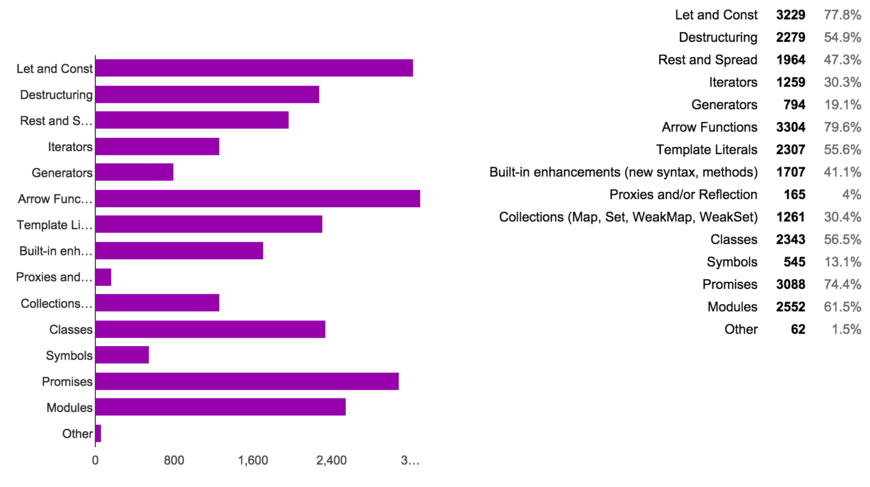

# Introdução ao Javascript

## O que é Javascript?

* Linguagem feita originalmente para os browsers, que são \*\*Runtine Environments \(Ambiente de

  execução\)\*\*

* Cada browser possui sua própria **JS Engine \(Ou interpretador javascript\)**.
* Não pode ter sua estrutura original modificada pois isso quebraria sites legados.
* Mas recebe constantemente atualizações **\(ES6/ECMAscript2015\)** por instituições de padronização

  **\(ECMA\)**

## Javascript Engine ou Motor Javascript

* JS engine **transforma o código .js em código de máquina e o executa**.
* A própria engine é quem **se comunica com a CPU** e executa o código de máquina.
* O processo é chamado de interpretação, logo **JS é interpretado**.
* É **diferente da compilação**, onde o compilador \(ex: GCC\) apenas compila o código para código de

  máquina, que deve ser executado posteriormente pelo próprio usuário.

* Exemplos de JS engines: Chackra\(Edge\) SpiderMonkey\(Firefox\) e **V8\(Google Chrome\)**

## Runtime Environment ou Ambiente de Execução

* Acrescentam às engines um **ambiente com scripts, bibliotecas e APIS** úteis ao seu contexto.
* O **browser** implementa um runtime environment para **clientes**, e acrescenta por exemplo funções de

  **manipulação do DOM/HTML** \(`document.getElementById()`\)

* **Node** é um runtime environment para **servidores**, e acrescenta por exemplo funções de acesso aos

  **arquivos do sistema** \(`fs.readfile()`\)

Tanto o Google Chrome quanto Node utilizam a mesma JS Engine, o V8.

## ECMA, ES6, ECMAScript2015

* Sigla para European Computer Manufacturers Association
* **ECMA é uma Instituição de padronização** altamente respeitada que já padronizou outras linguagens como o C\#
* Lançam periodicamente novas versões do ECMAScript com **novas funcionalidades** do JS. 
* Versões demoram para serem implementadas nos browsers. Ferramentas como o 

  **Babel.js transpilam código** de especificação nova para o dito **Vanila.js \(Javascript "Puro"**\).

* A **ECMAScript2015 ou ES6** é a versão que utilizaremos, por ter sido implementada na grande maioria

  dos browsers sem necessidade de transpilação.

Imagem de [Kostas Diakogiannis](https://www.goconqr.com/c/64835/course_modules/108563-es6-next-generation-javascript)

Funções mais úteis do ES6 [de acordo com 5000 programadores](https://ponyfoo.com/articles/javascript-developer-survey-results) 

## Criando Código em JS

## Criando Código em JS

Resto do conteúdo aqui https://pdfhost.io/v/TZkuEvDP5_javascriptpdf.pdf
