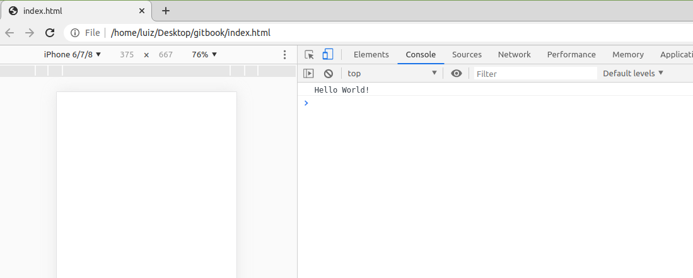

# Introdução ao Javascript - Básico

## O que é Javascript?
JavaScript é uma linguagem de programação criada para os **navegadores**. Ela é responsável por permitir a interação entre os usuários e a uma página web. O **HTML** define a **estrutura** da página, o **CSS** a **estilização** e o **Javascript** é quem permite desenvolver **funcionalidades** na página, tornando-a **dinâmica**. 

Hoje, é uma das linguagens mais utilizadas do mundo e é a mais importante para o desenvolvimento web. 

## Por que Javascript e não C, Java ou Python?
Porque não é possível criar um script em C, Java ou Python diretamente executável pelo browser. Javascript é a **linguagem nativa dos navegadores**. A prática não é incomum na computação: Java/Kotlin são as linguagens nativas do Android e Swift/Objective-C do IOS.


É possível **transpilar** (Transformar um código de uma linguagem para outra) C, Java ou python em Javascript. Mas, no fim das contas, o script final é em javascript e as funcionalidades da linguagem original serão limitadas pelo que Javascript é capaz de executar. O que define se uma linguagem pode ou não ser executada diretamente no navegador é o desejo e esforço dos próprios navegadores em torná-la compatível com o produto. Cada navegador é diferente e, em teoria, seria possível construir um que implemente outra linguagem. Mas, na prática, Javascript se tornou a principal, e, até recentemente, a única.


Há iniciativas que buscam implementar outras linguagens no Browser. A principal delas é o **Web-Assembly**, criado em **2017**. O projeto é desenvolvido pela W3C (Principal organização de padronização da Web), Mozilla, Microsoft, Google e Apple. Seu objetivo é definir um padrão de formato binário executável pelo navegador, o **wasm**. Seria possível por exemplo compilar C++ em wasm e executá-lo da mesma maneira que se executa Javascript. Além do Javascript, **Web-assembly é a única outra maneira nativa certificada pela W3C para rodar código em navegadores**. O projeto está em fase inicial, mas é extremamente promissor. Já é possivel executar wasm no Mozilla e Chrome, por exemplo.


É importante salientar que o Web-Assembly não tem por objetivo substituir o Javascript, e sim complementá-lo para casos de uso específicos que requerem **operações computacionalmente custosas**. Por exemplo, um editor de imagens online. A imensa maioria das páginas pode ser implementada apenas com Javascript, e não faz sentido aprender wasm antes de se dominar o js. 


Por fim, outra grande vantagem do Javascript é sua recente ascenção como linguagem para servidores por meio do **Node**. Ao se aprender uma única linguagem, já é possível criar uma base sólida para desenvolvimento front-end (cliente) e back-end (servidor). 

## Criando Código em JS

São necessários apenas um **navegador** e **editor de texto** para executar javascript.

Crie dois arquivos, um `index.html` e um `main.js`. Ao fim do `<body>` de`index.html` criar uma referência para `main.js`:



```markup
<!DOCTYPE html>
<html>
    <head>
        <meta charset="utf-8">
        <meta name="viewport" content="width=device-width, initial-scale=1">
        <link rel="stylesheet" href="">
    </head>
    <body>
        <script src="main.js"></script>
    </body>
</html>
```



```javascript
console.log('Hello World!')
```



O código acima escreve \`Hello World!" no console do navegador.

## Console

Uma ferramenta de desenvolvimento embutida no navegador. Permite ver a saída de scripts linkados ao html ou mesmo escrever código.

* No **Google Chrome** e **Firefox**, é acessível via `Ctrl Shift I`
* Também pode ser acessado com `Right Click` -&gt; `Inspect`




A vantagem do console é sua praticidade: É possível testar código ou mesmo performar sobre páginas e acessar suas variáveis sem lidar com arquivos. Entretanto, é importante notar que a única maneira de **escrever código persistente** (Acessível após execução) é utilizando arquivos `.js`. Códigos feitos a partir do console do navegador **não são salvos** em lugar algum, sendo portanto perdidos quando se encerra o browser.

### `console.log`

Imprime o resultado de uma **expressão em javascript** no console.

```javascript
console.log(3+4)            // Imprime 7
console.log("Hello World") //Imprime Hello World
```

## Declaração de variáveis: var vs let vs const

Os comandos `var`, `let` e `const` permitem declarar variáveis.

* `var`: **Legado**. Possui escopo da **função na qual foi declarada**, o que pode gerar efeitos colaterais indesejados.

  ```javascript
  function usesVar(){
    var outside_block = 1

    if (outside_block == 1){
        var inside_block = 2
    }

    console.log(inside_block)
  }
  usesVar()
  ```

  A função **funciona e imprime 2**. Na prática, o comportamento é indesejado, pois seria mais **seguro** que unidades declaradas dentro de blocos \(no caso, o **condicional if**\) existissem apenas dentro deles.

* `let`: **ES6: Melhor prática!**. Possui escopo do **bloco, instrução ou expressão** no qual foi declarada.

  ```javascript
  function usesLet(){
      let outside_block = 1

      if (outside_block == 1){
          let inside_block = 2
      }

      console.log(inside_block)
  }

  usesLet()
  ```

  lança o seguinte erro:

  

  Variáveis declaradas com let geram menos efeitos colaterais no código, sendo portanto recomendadas.

* `const`: **ES6: Melhor prática para valores constantes**, pois é imutável¹. Seu escopo é o mesmo de `let`.

  ```text
  let a = 'a'
  const b = 'b'
  a = 'c' // Permite mudança
  b = 'c' // TypeError: Assignment to constant variable
  ```

  ¹ \[Extra\]: const em objetos imutabiliza apenas sua referência e não conteúdo. `Object.freeze` imutabiliza um objeto, mas objetos podem tem outros objetos como atributos, o que só imutabiliza as referências dos objetos da "primeira camada". É necessário aplicar `Object.freeze`recursivamente para criar objetos verdadeiramente imutáveis. Verificar [Este artigo](https://stackoverflow.com/questions/34776846/how-to-freeze-nested-objects-in-javascript)

## Tipagem

Javascript possui tipagem **Dinâmica**:

* Não é possível declarar o tipo da variável, que é atribuído automaticamente.
* É possível modificar o tipo de uma variável.
* O comando `typeof()` permite descobrir o tipo atual.

### Number

Armazena números, sejam eles inteiros ou floats.

```javascript
let inteiro = 3
let float = 3.5

console.log(typeof(inteiro), typeof(float)) //number number
```

### Strings

Armazenam qualquer text entre parênteses simples ou duplos.

```javascript
let my_string = 'olá mundo'
console.log(typeof(my_string)) //string
```

Confira a aula 2 \(Strings\) para maiores informações sobre o tema.

### Boolean

Armazena veracidade de expressões, que pode ser:

* `true`, equivalente a **1**
* `false`, equivalente a **0**

```javascript
let verdadeiro = true
console.log(verdadeiro, typeof(verdadeiro)) //true "boolean"
```

São normalmente utilizadas em conjunto a outros operadores lógicos:

* `!` representa NOT
* `&&` representa AND
* `||` representa OR


```javascript
let verdadeiro = true
let falso = false

console.log('!v', !verdadeiro)
console.log('!f', !falso)

console.log('v&&v: ', verdadeiro && verdadeiro)
console.log('v&&f: ',verdadeiro && falso)
console.log('f&&f: ', falso && falso)

console.log('v||v: ', verdadeiro || verdadeiro)
console.log('v||f: ',verdadeiro || falso)
console.log('f||f: ', falso || falso)
```

imprime

```java
!v false
!f true

v&&v:  true
v&&f:  false
f&&f:  false

v||v:  true
v||f:  true
f||f:  false
```

#### Verificação de igualdade

* `==` Verifica se operandos tem o mesmo valor, independente do tipo.
* `===` Verifica se operandos tem o mesmo valor e tipo.

```javascript
console.log(1 == '1')      //true
console.log(1 === '1')     //false
console.log(1 === 1)       //true

console.log(true == 1)     //true
console.log(true === 1)    //false
console.log(true === true) //true
```

### undefined vs null

**undefined** Representa o acesso a uma variável existente mas não inicializada.

```javascript
let nao_inicializada
console.log(nao_inicializada, typeof(nao_inicializada)) // undefined undefined
```

Já **null NÃO É TIPO!** é apenas o estado de um objeto que propositalmente não tem conteúdo.

```javascript
a = null
console.log(a, typeof(a))//null object
```

**Tudo em JS que não é um dos tipos primitivos acima listados é objeto. Isto será estudado mais a frente.**

