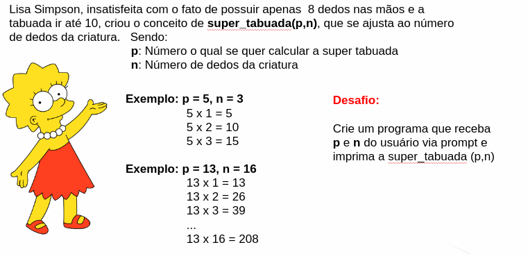

# Laços de Repetição

É recorrente a situação onde se deseja **repetir o mesmo algoritmo** diversas vezes, com determinado **estado inicial**, **condição de parada** e variações pré-definidas em algumas das variáveis \(processo conhecido como **iteração**\). Por exemplo, a impressão da tabuada do 7:

```text
7x1 = 7
7x2 = 14
7x3 = 21
...
7x10 = 70
```

O cálculo do resultado não é difícil, mas criar um código que realiza a impressão sem uma estrutura de repetição seria trabalhoso:

```javascript
let i = 1
console.log("7x1 = ", 7*1)
console.log("7x2 = ", 7*2)
console.log("7x3 = ", 7*3)
// ...
console.log("7x10 = ", 7*10)
```

Mais que isso, a tarefa seria **impossível** caso, ao invés de uma tabuada tradicional, onde são impressos os `n=10` inteiros multiplicados por 7, se desejasse imprimir a **enésima** tabuada do 7. Por exemplo, imprimir de 7x1 a 7x35, com `n=35` definido pelo usuário durante a **execução** do programa.

O problema pode ser facilmente resolvido com a estrutura `for`.

## for

Define uma iteração a partir de três parâmetros:

* **Condição inicial** das variáveis, executada apenas **uma vez** no início do for.
* **Condição de parada**, testada **a cada iteração**.
* **Atualização** das variáveis de **condição de parada**, executada **a cada iteração**. 

Seu formato é o seguinte:

```javascript
for(condição inicial, parada, atualização){
    //código a ser repetido
}
```

Por exemplo, imprimir os números de 0 a 100 utilizando um for é simples:

```javascript
for(let i = 0; i < 101; i+=1){
    console.log(i)
}
```

A nomenclatura `i` para variáveis numéricas de parada é uma convenção utilizada em muitos livros.

Para resolver o problema da tabuada, basta quebrá-lo em condição inicial, parada e atualização:

* Condição inicial: Multiplicando = 0
* Condição de parada: multiplicando &lt; n
* Atualização: multiplicando +=1

```javascript
let parada = Number(prompt("Digite a enésima tabuada"))

for(let multiplicando = 0; multiplicando <= parada; multiplicando++){
    let resultado = 7 * multiplicando
    console.log("7x" + multiplicando + " = " + resultado)
}
```



